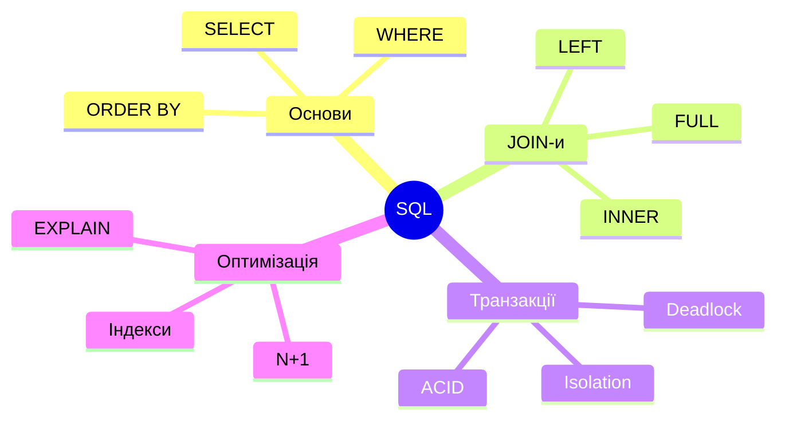
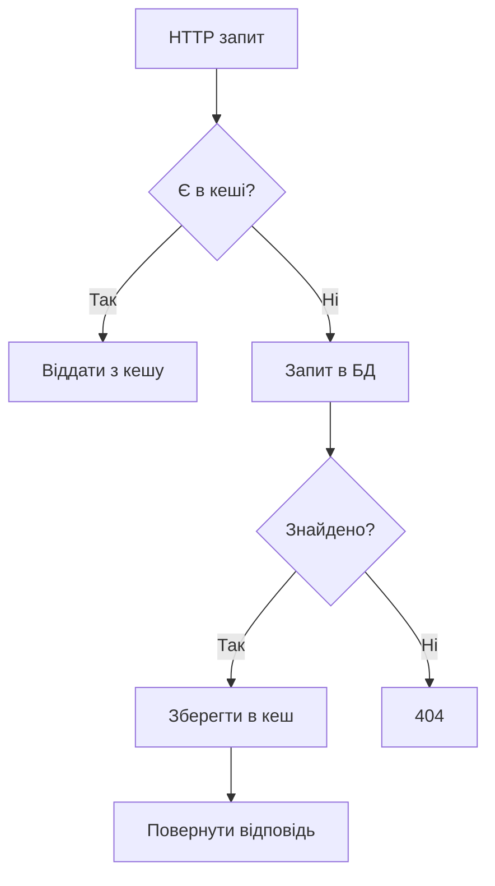
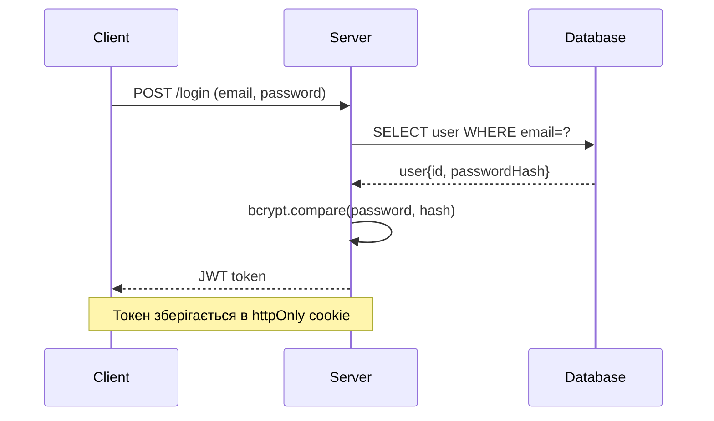
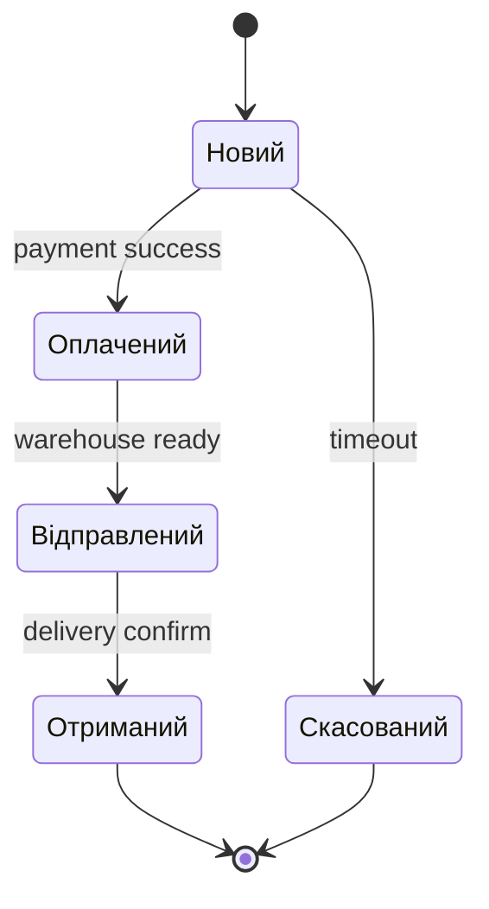
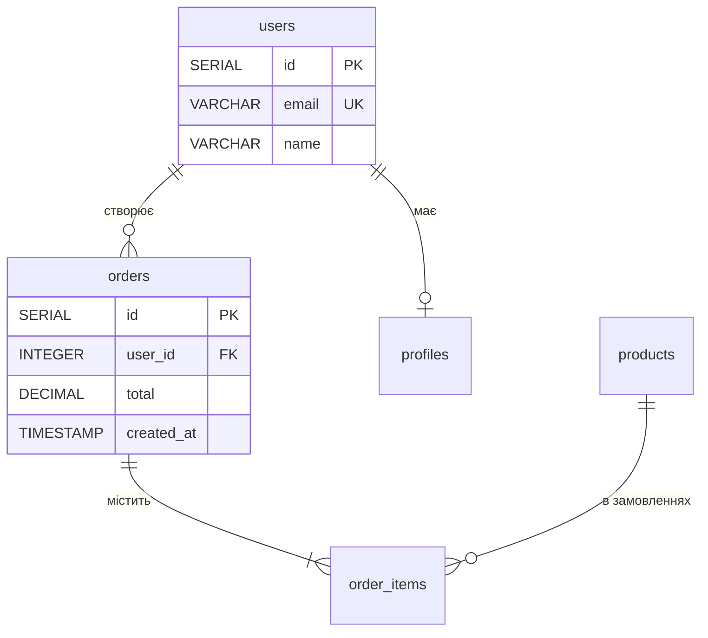
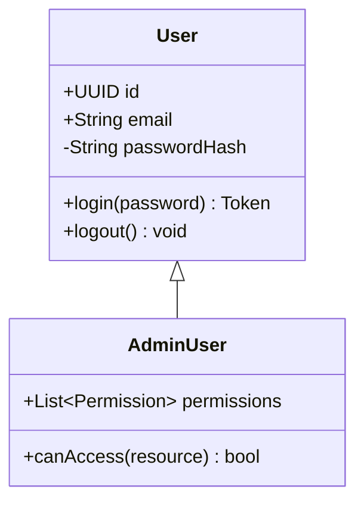
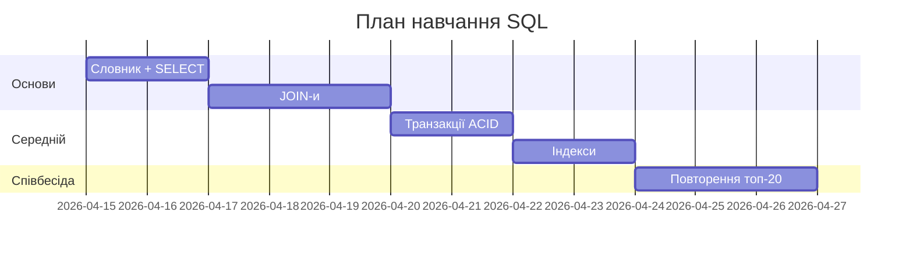

# Mermaid patterns для візуалізації навчання

> ⚠️ **Скоуп: тільки VS-Code-гілка.** Спершу визнач середовище читання за
> `visual_patterns.md`. Якщо учень **не** у VS Code — цей файл не твій: там списки й таблиці.

Плагін `Markdown Preview Mermaid Support` у VS Code рендерить ці діаграми в попередньому перегляді.

**Правило №1:** візуалізуй **матеріал**, не питання. Показуй концепції, процеси, зв'язки — не "який JOIN вибрати".

**Правило №2:** одна діаграма = одна ідея. Якщо треба показати два різні процеси — дві діаграми.

**Правило №3:** текст на діаграмі українською (крім технічних назв — `SELECT`, `JOIN`, `HTTP GET`).

---

## 1. `mindmap` — карта теми (огляд)

**Коли:** на початку `plan.md` і на початку великого блоку в `learn.md`. Учень бачить всю тему одним поглядом.

**Правила:**
- Root — назва теми в подвійних дужках `((...))`
- 4-7 гілок першого рівня (не більше — перевантаження)
- 2-5 під-гілок (якщо більше — це окрема діаграма)

---

## 2. `flowchart` — процес / ланцюжок рішень

**Коли:** life cycle, алгоритм, ланцюжок рішень "якщо X то Y".

**Напрямки:**
- `TD` / `TB` — зверху вниз (найзрозуміліший)
- `LR` — зліва направо (для timeline-подібних)
- `BT` / `RL` — рідко

**Форми:**
- `[Прямокутник]` — дія
- `{Ромб}` — рішення / умова
- `([Капсула])` — початок/кінець
- `[(Циліндр)]` — база даних
- `[/Паралелограм/]` — ввід/вивід

---

## 3. `sequenceDiagram` — взаємодія систем у часі

**Коли:** HTTP запит, OAuth flow, WebSocket handshake, взаємодія мікросервісів.

**Стрілки:**
- `->>` — синхронний виклик
- `-->>` — відповідь
- `-x` — помилка / не отримано
- `Note over A,B: текст` — коментар

---

## 4. `stateDiagram-v2` — стани і переходи

**Коли:** замовлення (новий → оплачений → відправлений), сесія, конечний автомат.

---

## 5. `erDiagram` — сутності і зв'язки (для БД / доменної моделі)

**Коли:** структура БД, доменна модель, зв'язки між агрегатами.

**Зв'язки (кардинальність):**
- `||--||` — 1:1
- `||--o{` — 1:N (один-до-багатьох) — **найчастіший**
- `}o--o{` — M:N (багато-до-багатьох)
- `||--o|` — 1 до 0-або-1

---

## 6. `classDiagram` — структура класів / модулів

**Коли:** OOP, структура модулів, паттерни GoF.

**Нотація:**
- `+` публічний, `-` приватний, `#` protected
- `<|--` наслідування
- `*--` композиція
- `o--` агрегація

---

## 7. `gantt` — план навчання у часі (опційно)

**Коли:** роадмапа "тиждень 1, тиждень 2..." для довгих планів.

---

## Коли НЕ використовувати Mermaid

- Коли таблиця краще передає інформацію (порівняння, матриця)
- Коли діаграма має понад 15 вузлів — вона стає нечитаємою, розбивай
- Коли це одне речення — просто напиши його
- Для питань на перевірку розуміння (не візуалізуй питання)

## Скільки діаграм у файлі

- `plan.md`: **мінімум 1 mindmap** на початку
- `learn.md`: **3-7 діаграм** на ключові концепції
- Якщо тема повністю текстова (історія, філософія) — можна без діаграм
- Не впихай діаграму "для краси" — тільки якщо вона пояснює краще за текст
