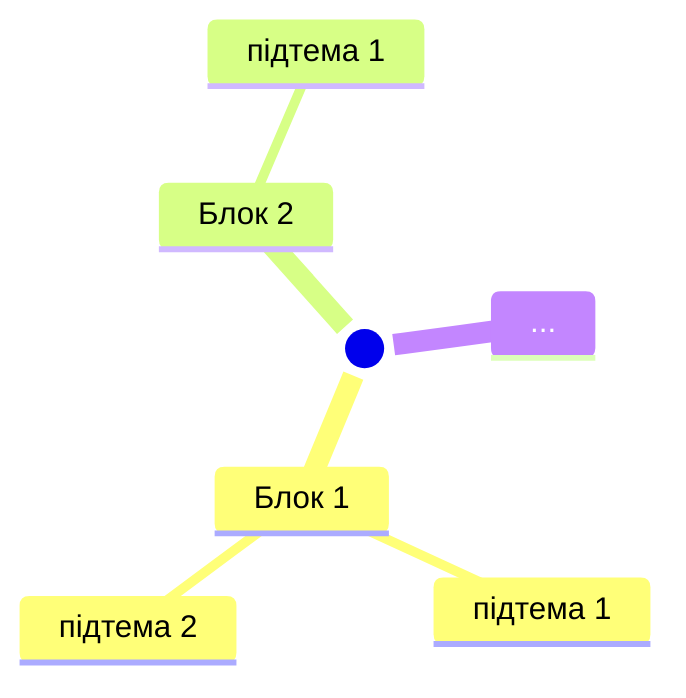

# Шаблон `<topic>_plan.md` — план навчання

Призначення: **мапа** теми. Учень читає план щоб зрозуміти що вчити, в якому порядку, що питають на співбесіді. Цей файл короткий і структурований. Повний матеріал — у `<topic>_learn.md`.

Референс — будь-який уже готовий `<topic>_plan.md` у робочій теці (напр. `bd/sql/sql_plan.md`, якщо він є). Якщо готових курсів ще немає — орієнтуйся тільки на структуру нижче.

---

## Структура файлу

```markdown
# <Topic>: Навчальний план від нуля до <співбесіди / проєкту / мети>

> Кожна тема — через 7-крокову структуру Фейнмана.
> Рівні: `[Базовий]` `[Середній]` `[Просунутий]`
> Позначка `[Співбесіда]` = питають часто на інтерв'ю
> Джерела: <офіційна документація, посилання>

---

## 🗺️ Карта теми (огляд)

<Карта теми — усі блоки одним поглядом. ОБОВ'ЯЗКОВО.
Формат: `mermaid mindmap` якщо учень у VS Code, інакше — вкладений список зі статусами
(патерн 1 у `visual_patterns.md`). Приклад Mermaid-варіанта нижче.>



<Після mindmap — таблиця ВСІХ вимірів теми, які експерт вважав би обов'язковими.
Виміри бери з research-джерел (лінза 4), НЕ з голови. ОБОВ'ЯЗКОВО.>

| Вимір теми | Статус | Де в курсі / чому відкладено |
|---|---|---|
| <вимір 1> | ✅ розкрито | Блок 2 |
| <вимір 2> | 🔜 відкладено | не критично для цілі зараз, вчити після <X> |
| <вимір 3> | ❌ поза скоупом | <причина> |

---

## Блок 1: Словник — Що означають слова `[Базовий]`

<Таблиця термін → простими словами → аналогія. 15-25 термінів.>

| Термін | Що це простими словами | Аналогія |
|--------|----------------------|----------|
| **Термін** (вимова) | Коротко | Побутова аналогія |

---

## Блок 2: <Назва базової теми> `[Базовий]` `[Співбесіда]`

### 2.1 <Підтема>

**Суть:** 1 речення простою мовою.

<мінімальний приклад коду / команди>

### 2.2 <Підтема>
...

---

## Блок 3..N: <Теми з зростанням складності>

<Тут має бути 5-10 блоків залежно від теми. Для кожного:>
- Рівень: `[Базовий]` / `[Середній]` / `[Просунутий]`
- Маркер `[Співбесіда]` якщо питають
- 3-7 підрозділів з мінімумом коду
- Для складних блоків — посилання на `<topic>_learn.md#якір`

---

## Блок N+1: Типові помилки та пастки `[Співбесіда]`

| Помилка | Чому погано | Як правильно |
|---|---|---|
| ... | ... | ... |

---

## Блок N+2: Best Practices

<список правил з коротким поясненням чому>

---

## Блок N+3: Екосистема та інструменти

<Що існує в домені і для чого. Кожен пункт з призначенням — голі списки назв заборонені.>

| Інструмент/ресурс | Для чого | Коли без нього не можна | Безкоштовний? |
|---|---|---|---|

---

## 🎯 Шпаргалка для співбесіди

**Топ-15 питань які питають:**

1. **<Питання>?** — <коротка відповідь + посилання на блок>
2. ...

---

## 📈 Що вчити в якому порядку (80/20)

<Критично важлива секція. Учень має знати з чого почати.>

**Тиждень 1 (базовий мінімум):**
- Блок 1 (словник) — без цього нічого не зрозуміло
- Блок 2 — основа
- ...

**Тиждень 2 (робочий рівень):**
- ...

**Тиждень 3+ (просунуте / під співбесіду):**
- ...

**Якщо співбесіда завтра** — вчи тільки блоки з `[Співбесіда]`: 2, 3, 5, 7.

---

## 🧪 Як перевірити що знаєш (тест Фейнмана)

Можеш пояснити другові без програмування:
- [ ] Що таке <core concept>? (аналогія + 1 приклад)
- [ ] Коли використовувати X а коли Y?
- [ ] Чому <нетривіальне правило> саме так?

Якщо хоч один пункт "ні" — вертайся до відповідного блоку.

---

## 📚 Наступні кроки

- Повний матеріал з прикладами → `<topic>_learn.md`
- Практика → <де практикуватись: песочниця, проєкт, завдання>
- Reflection diary → в кінці `<topic>_learn.md`
```

---

## Принципи заповнення

1. **Mindmap обов'язково** на початку — учень має побачити цілу карту за 10 секунд.
2. **Маркери рівнів і `[Співбесіда]`** — на кожному блоці. Без них план безпорадний.
3. **Порядок блоків = від простого до складного.** Базовий → Середній → Просунутий. Не змішуй.
4. **Кожен блок має практичну цінність.** Якщо блок "теоретичний і ніколи не питають" — викинь або зазнач `[Опційно]`.
5. **Секція "80/20" критична.** Учень має розуміти що вчити першим, що останнім.
6. **Код у плані — мінімум.** 2-3 рядки щоб показати суть. Повні приклади — в `learn.md`.
7. **Шпаргалка для співбесіди** — відповіді в 1-2 речення + посилання на блок де пояснено повно.
8. **Кожна рекомендація — з «чому» та альтернативою** (лінза 2 канону): «X, бо ‹критерій›; якщо ‹умова› — тоді Y». Безальтернативних порад немає.
9. **Карта теми — чесна і повна:** виміри з research-джерел; нерозкриті виміри позначай 🔜/❌ з причиною, а не мовчазно пропускай.

## Розмір

- Маленька тема (1 концепція): 100-300 рядків
- Середня тема (мова / бібліотека): 300-800 рядків
- Велика тема (SQL / система): 800-2000 рядків

Якщо виходить більше 2000 — розбивай на підтеми з окремими файлами.
