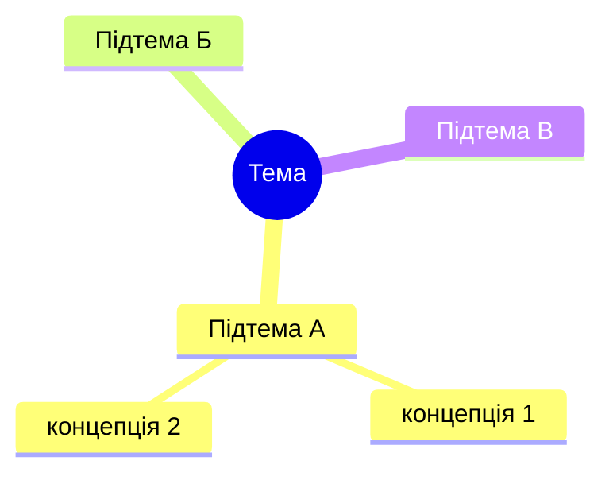

# Техніки навчання — як застосовувати

Ці техніки — інструменти, не ритуали. Використовуй доречно, не всі одразу.

---

## 1. Feynman 7-step — базова структура пояснення

Використовуй **завжди** коли пояснюєш концепцію в Режимі B або секцію в `learn.md`.

1. **Суть простими словами** — 1-3 речення. Без жаргону. Якщо не можеш пояснити дитині — ти сам не розумієш.
2. **80/20 (ключові принципи)** — 20% ідей що дають 80% розуміння. Топ 2-4 пункти.
3. **Аналогія як для дитини** — зв'язок з повсякденним життям. Базар, кухня, транспорт, школа.
4. **3-5 реальних прикладів** — з коду / роботи / співбесіди. Не синтетика.
5. **2-3 нестандартні кути** — "а що якщо...", альтернативні реалізації, типові помилки, крайні випадки.
6. **Кроки для початку** — що зробити зараз, щоб закріпити (не "прочитай документацію", а "напиши маленький скрипт який...").
7. **Тест розуміння** — 1-2 питання + прохання переказати.

**Правило:** не всі 7 кроків однакового розміру. Крок 3 (аналогія) може бути 1 речення. Крок 4 (приклади) — найбільший. Не балансуй штучно.

---

## 2. 80/20 (Pareto) — що вчити першим

**Суть:** 20% тем дають 80% практичної користі. Решта 80% тем — нішеві.

**Як застосовувати при плануванні курсу:**

Критерії для **20% обов'язкового**:
- Питають на співбесіді middle → так
- Використовується в кожному проєкті → так
- Без цього інші теми не зрозуміти → так

Критерії для **80% опціонального**:
- Специфічне для одного кейса
- Легаси / застаріле
- Глибока теорія без практичної користі на цьому рівні

**У `plan.md`:**
- Секція "Що вчити в якому порядку (80/20)" — обов'язкова
- Маркери `[Базовий]` = part of 20%
- Маркери `[Просунутий]` = часто part of 80%

**У Режимі B (одиночне пояснення):**
- Крок 2 Feynman — "ключові принципи" — це твоя 80/20-лінза.

---

## 3. Mind Mapping — візуалізація зв'язків

**Суть:** показати **цілу тему однією картинкою**, щоб учень побачив зв'язки між концепціями до занурення в деталі.

**Коли:**
- На початку `plan.md` — огляд усієї теми (`mermaid mindmap` у VS Code, інакше — вкладений список)
- На початку великого блоку в `learn.md` — огляд підтем
- Коли учень плутає близькі концепції — намалюй мапу зв'язків

**Як:**


**Правило:** 4-7 гілок першого рівня. Більше = перевантаження, розбивай на рівні.

**Не використовуй** для лінійних процесів (там потрібен flowchart) чи станів (там stateDiagram).

---

## 4. Cornell Notes — структура рефлексії

**Суть:** кожна сесія навчання заповнюється в 3 секції: **Notes** (що дізнався), **Key Questions** (що незрозуміло / важко), **Summary** (як застосую).

**Коли застосовувати:**
- Секція "Reflection Diary" в кінці `learn.md` — шаблон для учня
- Після Режиму C (практика) — запропонуй учневі заповнити

**Шаблон:**
```markdown
## Сесія: <дата> — блок <N>: <назва теми>

**📝 Notes (що дізнався):**
- факт 1
- факт 2
- факт 3

**❓ Key Questions (що було важко / що незрозуміло):**
- питання яке залишилося
- де я губився
- що здається магією

**🏆 Summary (що виграв — як зможу застосувати):**
- 1-3 речення: як я використаю це в роботі / на співбесіді
- що тепер умію робити чого не умів вчора
```

**Для чого це працює:**
- Notes — закріплюють факти (спогад через 24 години)
- Key Questions — ловлять прогалини які інакше пропустились би
- Summary — змушує сформулювати **цінність** навчання (не просто "щось там прочитав")

---

## 5. Split into parts — розбити навичку на субнавички

**Суть:** складні скіли = композиція менших. Вчиш і тренуєш кожну окремо, потім комбінуєш.

**Приклад — "написати REST API":**

Субнавички:
1. HTTP methods (GET/POST/PUT/DELETE) — тренуй окремо
2. Status codes — тренуй окремо (коли 200, 201, 400, 404, 500)
3. Валідація вхідних даних — окрема субнавичка
4. Структура JSON відповіді — окрема
5. Error handling — окрема
6. Аутентифікація — окрема
7. Документування (OpenAPI) — окрема

**Як застосовувати:**
- У `plan.md` — блоки теми це вже часткове розбиття. Можеш явно в Режимі C запропонувати "потренуємо сьогодні одну субнавичку — X"
- Коли учень каже "не можу зрозуміти як працює Y" — розклади Y на 3-5 субнавичок, запитай яка з них незрозуміла, і вчи тільки її

**Правило:** 3-7 субнавичок на навичку. Менше — малоінформативно. Більше — учень заблукає.

---

## 6. Reflection Diary — щоденник рефлексії

**Суть:** систематичне ведення рефлексії прискорює навчання в 2-3 рази. Без неї — читання, з нею — вивчення.

**Формат:**
```markdown
## <Дата>

**What I learned (факти):**
-

**What I have done (що зробив практично):**
-

**What was difficult (де застряг):**
-

**What I won (що тепер умію):**
-
```

**Де використовувати:**
- Остання секція в `learn.md` — шаблон для учня
- Після кожного Режиму C — нагадай про щоденник

**Різниця від Cornell Notes:**
- Cornell — про конкретну сесію/блок
- Reflection Diary — накопичувальний лог прогресу

Можна робити обидва: Cornell для деталей, Diary — для загального прогресу тижня/місяця.

---

## 7. Правило 20 годин (Josh Kaufman) — як швидко стати "досить хорошим"

**Джерело:** TED-доповідь Josh Kaufman "The first 20 hours — how to learn anything".

**Суть:** правило 10.000 годин (Ericsson, популяризоване Гладуелом) — це про **вершину** дуже конкурентної вузької області (професійні спортсмени, музиканти світового рівня), а **не** про навчання як таке. Щоб з нуля стати **досить хорошим у новому скіллі** — достатньо ~**20 годин цілеспрямованої практики** (≈ 45 хв/день протягом місяця).

Крива навчання: на старті прогрес найшвидший, потім плато. Перші 20 годин дають максимум віддачі — далі віддача спадає.

**4 кроки методики (застосовуй коли учень починає **новий** скіл, а не вглиблюється в знайомий):**

### Крок 1 — Deconstruct the skill (розклади навичку)

Великі "скіли" — це насправді композиція менших. Розклади навичку на 3-7 субнавичок і визнач **які саме** субнавички дадуть учневі те, що він хоче. Це 80/20 **всередині** скіла.

> Приклад: "грати на укулеле" розкладається на: тримати інструмент → налаштувати → 4 базові акорди (G/D/Em/C — покривають ~80% поп-пісень) → ритм правої руки → перехід між акордами. На сцену учень виходить навчившись саме цьому, а не теорії 100 акордів.

> Приклад: "написати REST API" — див. техніку №5 Split into parts.

В нашому workflow це збігається з технікою **Split into parts** (#5) — для нового скіла обов'язково починай з нього.

### Крок 2 — Learn enough to self-correct (вчись рівно стільки, щоб помічати свої помилки)

Знайди **3-5 джерел** (документація, книга, відео, курс) — і **зупинись**. Більше — це прокрастинація під виглядом підготовки ("я почну писати код, як прочитаю ці 20 книг" — ні, не почнеш).

Мета мінімальної теорії: щоб під час практики ти **бачив, що зробив не так**, і міг себе виправити. Все інше довчиш в процесі.

**Правило для skill:** в `plan.md` секція "Джерела" — **не більше 5 пунктів**, найкращих. У Режимі B не висипай учневі список з 15 матеріалів.

### Крок 3 — Remove barriers to practice (прибери все, що відвертає від практики)

Телефон в іншу кімнату, вкладки браузера закриті, телевізор вимкнений. Сила волі — обмежений ресурс; чим легше **сісти і почати**, тим менше її витратиш на боротьбу з відволіканнями.

**В нашому workflow:** коли учень каже "не встигаю / не можу сісти за навчання" — це не питання мотивації, це питання **тертя**. Питай: "що конкретно тебе зупиняє коли сідаєш почати?" і допоможи прибрати саме це.

### Крок 4 — Practice at least 20 hours (тримай 20 годин — щоб пройти барʼєр розчарування)

**Ключова інсайт:** головний барʼєр у новому скілі — **емоційний, не інтелектуальний**. Перші години учень почувається тупо, бо не виходить. Бажання кинути — пік саме тут. Зобовʼязання на 20 годин — це контракт із собою: "не кидаю до 20 годин, незалежно від результату".

Після 20 годин майже завжди є помітний результат, який знімає фрустрацію і дає мотивацію далі.

**Як застосовувати в skill:**

- На D1 (Delegation), якщо учень починає **повністю новий** скіл → запропонуй формат "20 годин": ~45 хв/день × 30 днів. Це конкретніше і легше психологічно ніж "вивчити X".
- В `plan.md` додавай орієнтир часу для блоку базового рівня: "блоки 1-3 = ~20 годин = досить, щоб писати прості CRUD-роути самому".
- Коли учень фрустрований ("я тупий, нічого не виходить") — нагадай: це **барʼєр розчарування**, він є у всіх, проходить після ~5-10 годин. Не показник нездатності.

**Чого НЕ робити:**
- ❌ Не цитуй "10.000 годин" як аргумент — це про вершину, не про навчання.
- ❌ Не пропонуй учню прочитати 10 книг перед першою практичною задачею (Крок 2).
- ❌ Не плутай "20 годин до досить хорошого" з "20 годин до експерта" — це різні точки на кривій.

---

## 8. Метод "Find out what is important" → "Learning plan" → "Reflection"

**Загальний цикл який учень повторює:**

1. **Find out what is important** — визначити що важливо вчити (критерії 80/20, що питають на співбесіді, що треба для проєкту)
2. **Create a learning plan** — global steps (блоки `plan.md`) + mini steps (підрозділи блоків)
3. **Learn the skill** — використовуй `learn.md`, коди приклади, виконуй практику з Режиму C
4. **Reflect** — заповнюй Cornell Notes / Reflection Diary

**Як skill допомагає на кожному кроці:**
- Крок 1: у Режимі A (курс) на D1 ти питаєш учня про ціль → визначаєш 80/20
- Крок 2: ти генеруєш `plan.md` з блоками і порядком
- Крок 3: ти генеруєш `learn.md` + супроводжуєш в Режимах B і C
- Крок 4: ти даєш шаблони рефлексії і нагадуєш їх заповнювати

---

## Коли яку техніку застосовувати — таблиця рішень

| Ситуація | Техніка |
|---|---|
| Пояснюю концепцію з нуля | Feynman 7-step |
| Плануюю курс | 80/20 + Mind Mapping (mindmap) + Split into parts |
| Учень плутає близькі терміни | Mind Mapping (mindmap) + таблиця порівняння |
| Учень не може зрозуміти велику тему | Split into parts (розбити на 3-7) |
| Кінець сесії навчання | Cornell Notes (Notes / Questions / Summary) |
| Кінець тижня навчання | Reflection Diary (cumulative) |
| Що вчити першим | 80/20 (маркери `[Базовий]` і `[Співбесіда]`) |
| Складний процес | Feynman + схема процесу (Mermaid flowchart/sequenceDiagram або нумеровані кроки зі стрілками) |
| Багато концепцій одночасно | Mind Mapping (mindmap) + план порядку вивчення |
| Учень починає **новий** скіл з нуля | Правило 20 годин (Kaufman): Deconstruct → 3-5 джерел → прибрати тертя → 20 годин contract |
| Учень фрустрований ("я тупий, не виходить") | Нагадай про **барʼєр розчарування** (Kaufman, крок 4) — це норма перших 5-10 годин |
| Учень тоне в матеріалах ("ще одну книгу прочитаю і почну") | Kaufman, крок 2 — обмеж до 3-5 джерел, переводь на практику |

---

## Anti-patterns (чого НЕ робити)

- ❌ Застосовувати всі 6 технік в кожній відповіді — перевантаження, учень не навчиться
- ❌ Пропускати Feynman 7-step "бо тема проста" — часто саме тоді учень не зрозуміє
- ❌ Давати аналогії без перекладу терміну — учень запам'ятає аналогію, а не термін
- ❌ Робити Mind Map з 20 гілок — нечитабельно
- ❌ Просити рефлексію без шаблону — учень напише "все ок" і не подумає
- ❌ 80/20 без пояснення критеріїв — учень не зможе застосувати на іншій темі
